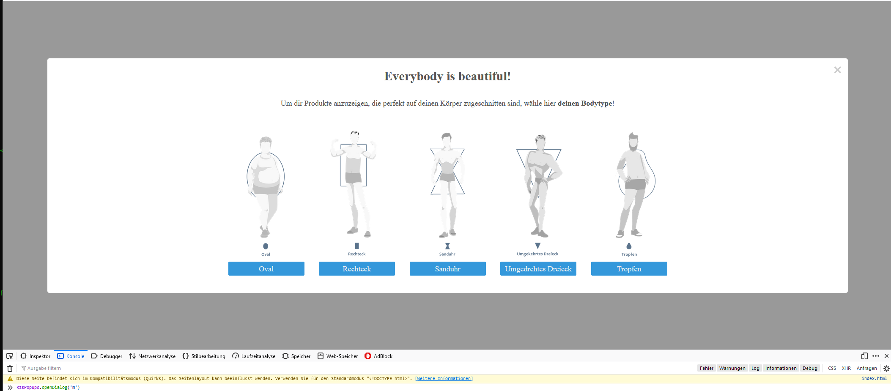

# Bodytype Popup

## Installation
Add following to the `<head></head>` tag.
```html
<script src="https://cdn.jsdelivr.net/gh/royalzsoftware/bodytype-popup@master/dist/rzspopups.min.js"></script>
```

## Dialoge
Entweder beim Öffnen der Seite öffnen, dafür im `<body></body>` tag folgendes:
```html
<script>
RzsPopups.openDialog('m'); // Dialog für männer
RzsPopups.openDialog('w'); // Dialog für Frauen
</script>
```

### Beispiel


### Links anpassen
Verfügbare Körpertypen für `setLink`: `oval, rechteck, sanduhr, umgedrehtes dreieck, tropfen`
```html
<script>
var RzsPopupConfig = new RzsPopups.ConfigBuilder();

RzsPopupConfig.setLink('oval', 'https://youtube.com', 'https://youtube.com');
RzsPopupConfig.setLink('umgedrehtes dreieck', 'https://youtube.com', 'https://youtube.com');
RzsPopupConfig.setLink('rechteck', 'https://rechteck.com', 'https://youtube.com');
RzsPopupConfig.setHeading('Hallo Welt');

RzsPopups.openDialog('w');
</script>
```

Ansonsten beim `onclick="RzsPopups.openDialog('m')"` oder `onclick="RzsPopups.openDialog('w')"`.
Wenn man eine Custom Config beim OnClick haben möchte, muss man diese vorher im Body anlegen und als zweiten
Parameter übergeben `RzsPopups.openDialog(gender, config)`.

### Config Fields
|field|typ|description|defaultValue|
|-----|---|-----------|------------|
|`bodyTypes`|Array|Enthält eine Liste an Body Type Definitionen|`[{name: 'Oval', href:'https://example.com', images: {m: mOval, w: wOval}}]`|
|`heading`|string|Dialogtitel|`Everbody is beautiful!`|
|`paragraphText`|string|Text unter Überschrift. HTML wird geparsed!|`Um dir Produkte anzuzeigen, die perfekt auf deinen Körper zugeschnitten sind, wähle hier <strong>deinen Bodytype</strong>!`|

### CSS überschreiben
Klassen, um bestimmtes CSS anzupassen kann man in `src/styles/main.css` nachlesen. Über jeder Klasse steht,
welchen Use Case diese haben.
Um bestimmte Werte anzupassen, kann es sein, das man ein `!important` anhängen muss.
